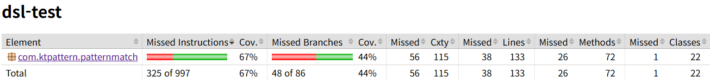
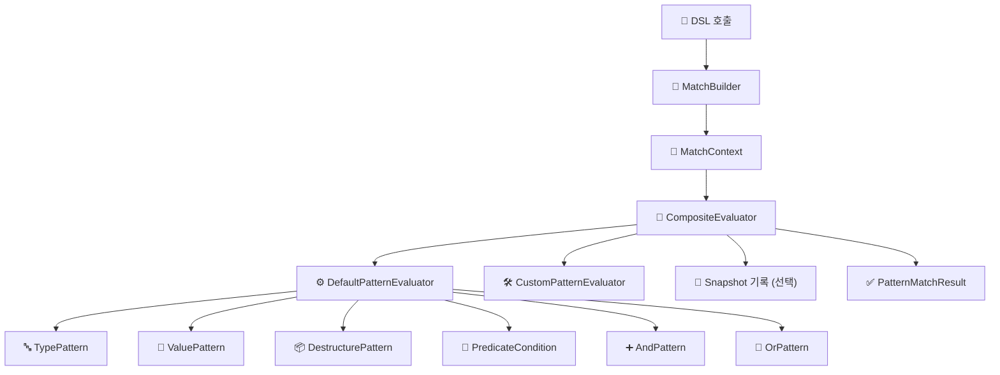

# 🔍 Kt-pattern - Kotlin Pattern Matching DSL

Kt-Pattern은 Kotlin에서 when 문의 한계를 극복하고,
더 선언적이고 구조적인 분기를 가능하게 해주는 패턴 매칭 DSL 라이브러리입니다.

Kotlin은 강력한 타입 시스템을 갖고 있지만,
복잡한 조건 분기나 패턴 기반 추론에서는 when 외에 마땅한 대안이 없습니다.
그래서 직접 만들었습니다.

이 라이브러리는 단순한 DSL을 넘어,
테스트 가능한 추론 구조, 스냅샷 기반의 로깅,
그리고 확장 가능한 Evaluator 체계까지 고려해 설계되어 있습니다.

---

## 🚀 Features

| 기능 | 예제 |
|------|------|
| **타입 기반 매칭 (Type Matching)** | `whenType<String> { "It's a String: $it" }` |
| **값 기반 매칭 (Value Matching)** | `whenValue(123) { "Matched value: $it" }` |
| **조건부 매칭 (Predicate DSL)** | `caseOf<Box<Int>>({ it.value > 10 }) { "Boxed: ${it.value}" }` |
| **구조 분해 매칭 (Destructuring Matching)** | `DestructurePattern(Box::class.java) { (v): Box<*> -> v == 42 }` |
| **스마트 캐스트 연계 (Smart Cast)** | `caseOf<Dog>({ it.age < 10 }) { "Young dog: ${it.name}" }` |
| **Sealed class 지원** | `whenType<Animal> { "Animal: $it" }` |
| **커스텀 패턴 정의 (Custom Pattern + Evaluator)** | `case(CustomPattern()) { ... }`<br/>+ `CompositeEvaluator(listOf(DefaultPatternEvaluator(), CustomPatternEvaluator()))` |
| **Evaluator 체이닝 처리 (CompositeEvaluator)** | `CompositeEvaluator(listOf(...))`로 순차 위임 평가 |
| **매칭된 값 DSL action에 전달** | `caseOf<Person> { person -> "Hi ${person.name}" }` |
| **매칭 과정 스냅샷 기록 (Snapshot Logging)** | `match(value, snapshotBinder = binder) { ... }`<br/>→ `binder.getAll()`로 결과 확인 가능 |

---

## 🔎 Snapshot Logging

매칭 과정의 입력값, 사용된 패턴, 매칭 결과(`Matched`, `NotMatched`, `Skipped`)를 **시간순으로 추적**할 수 있습니다.

```kotlin
val binder = SnapshotBinder()

val result = match("hello", snapshotBinder = binder) {
  whenType<String> { "String matched" }
  else_ { "No match" }
}

// ✅ 스냅샷 로그 안전하게 출력
val snapshots: List<Snapshot> = binder.getAll()
snapshots.forEach {
  println("✅ Status: ${it.status}, Value: ${it.value}, Pattern: ${it.pattern}")
}
```

---

## 🎯 Custom Pattern & Evaluator

기본 DSL 외에도 복잡한 조건이나 도메인 특화 매칭을 위해 **직접 Pattern과 Evaluator를 정의**할 수 있습니다.

### 1. Pattern 정의

```kotlin
class CustomPattern : Pattern<Any> {
    override fun match(value: Any): Boolean =
        value is String && value.startsWith("hey")

    override fun getType(): Class<*> = String::class.java
}
```

### 2. Evaluator 구현

```kotlin
class CustomPatternEvaluator : PatternEvaluator<Any> {
    override fun supports(pattern: Pattern<*>) = pattern is CustomPattern

    override fun evaluate(pattern: Pattern<Any>, value: Any): PatternMatchResult {
        val custom = pattern as CustomPattern
        return if (custom.match(value)) {
            PatternMatchResult.Success(value)
        } else {
            PatternMatchResult.Failure("Custom mismatch")
        }
    }
}
```

### 3. CompositeEvaluator에 등록

```kotlin
val evaluator = CompositeEvaluator(
  listOf(
    DefaultPatternEvaluator(),
    CustomPatternEvaluator()
  )
)
```

### 4. MatchBuilder에서 사용

```kotlin
val binder = SnapshotBinder()
val customPattern = CustomPattern()

val builder = MatchBuilder<Any, String>(evaluator, binder)

builder.case(customPattern) { value: Any ->
  "🎯 CustomPattern 매칭: $value"
}

builder.else_ { "매칭 안됨: $it" }

val result = builder.evaluate("hey there")

val logs: List<Snapshot> = binder.getAll()
logs.forEach {
  println("🎯 CustomPattern 매칭: value=${it.value}, status=${it.status}")
}
// 🎯 CustomPattern 매칭: value=hey there, status=Matched
```

---

## 🛠 기술 스택

| 항목         | 내용                                                                 |
|--------------|----------------------------------------------------------------------|
| 언어         | **Kotlin 1.9.x**                                                     |
| 빌드 도구    | **Gradle Kotlin DSL**                                                |
| 테스트 도구  | **JUnit5**, `kotlin-test`, `Jacoco`                                  |
| 프로젝트 구조 | 멀티 모듈 구조<br>`:dsl-core`, `:dsl-runtime`, `:dsl-dsl`, `:dsl-test`, `:examples:basic-example`, `:examples:advanced-example` |
| 예제 실행    | `./gradlew :examples:basic-example:run`<br>`./gradlew :examples:advanced-example:run` |


---

## 📦 Installation

`Kt-pattern`을 프로젝트에 추가하려면 아래와 같이 `build.gradle.kts` 또는 `build.gradle`에 의존성을 추가하세요.

### Kotlin DSL (`build.gradle.kts`)

```kotlin
dependencies {
  implementation("com.ktpattern:kt-pattern:1.0.0")
}
```

---

## 🧠 모듈 설계 목표 및 구성

본 프로젝트는 선언형 패턴 매칭 DSL의 **표현력, 재사용성, 확장성**을 높이기 위해  
다음과 같은 설계 원칙을 기반으로 멀티모듈 아키텍처를 구성합니다.

### 1. 구조 분리 (기능 책임별 모듈화)

- 핵심 추상화(core), evaluator 및 실행 로직(runtime), DSL 호출부(dsl) 등을 모듈로 분리하여 각 책임을 명확히 합니다.
- 의존성 방향은 단방향으로 구성되어 있으며, 하위 모듈에 대한 직접 접근 없이 동작합니다.

> 예: `dsl-dsl` → `dsl-runtime` → `dsl-core`

### 2. 실행 분리 (`main()` 기반 예제)

- `examples:basic-example`, `examples:advanced-example`을 통해 DSL의 실제 사용 흐름을 검증할 수 있습니다.
- 테스트 외에도 실동작 예시를 통해 구조적 이해와 디버깅을 지원합니다.

### 3. 내부 캡슐화 및 교체 가능한 구조

- 각 모듈은 동일한 패키지 네이밍을 따르기 때문에, 별도의 import 없이도 내부 구조 간 결합도를 낮춘 채 유연하게 구성할 수 있습니다. 예를 들어 `dsl-core`의 `Pattern` 구조를 변경하더라도 상위 DSL 호출부에서는 최소한의 수정만으로 대응 가능합니다.
- `PatternEvaluator`는 `ServiceLoader`를 통해 **구현 클래스가 자동 등록될 수 있으며**, 또는 코드 내에서 `CompositeEvaluator`를 통해 **수동으로 주입**하여 사용할 수도 있습니다.

> 즉, 구현체만 바꿔도 DSL 전체 흐름을 커스터마이징할 수 있는 **전략 패턴 기반의 유연한 구조**입니다.

📌 필요 시 web, batch, cli 등 다양한 실행 환경으로 DSL을 확장 가능하도록 설계되어 있습니다. 현재는 라이브러리 자체의 본질에 충실하게 의존성을 최소화하려 하며, 내부 기능의 완성도를 높이는 데에 초점을 두고 있습니다.

---

## 🧩 멀티모듈 구성

| 모듈명        | 설명                                                           |
| ------------- |--------------------------------------------------------------|
| `dsl-core`    | 핵심 구조 및 패턴 정의 (`Pattern`, `MatchResult`, `PatternEvaluator`) |
| `dsl-runtime` | 평가 로직 구현 (`DefaultPatternEvaluator`, `Snapshot`)             |
| `dsl-dsl`     | 사용자 DSL 호출부 (`match`, `case`, `MatchBuilder`)                |
| `dsl-test`    | 테스트 유틸 및 도구                                                  |
| `examples`    | DSL 사용 예시를 담은 실행 가능 데모 코드 (`main()`, 샘플 매칭 로직)               |

---

## Coverage

해당 수치는 jacoco를 통해 측정되었습니다.

---

## 🧱 Architecture Overview

사용자 DSL 호출  
▼  
**MatchBuilder** (패턴 + 액션 수집)  
▼  
**MatchContext** (입력값 + 패턴 목록 바인딩)  
▼  
**CompositeEvaluator** (순차적으로 evaluator 위임)  
├── DefaultPatternEvaluator  
│   ├── TypePattern  
│   ├── ValuePattern  
│   ├── DestructurePattern  
│   ├── PredicateCondition  
│   ├── AndPattern / OrPattern  
├── CustomEvaluator (선택적)  
└── SnapshotBinder (선택적 평가 기록)  
▼  
**PatternMatchResult** (Success / Failure / Bindings)
---


## 📝 License


This project is licensed under the [MIT License](./LICENSE) © 2025 Acacian