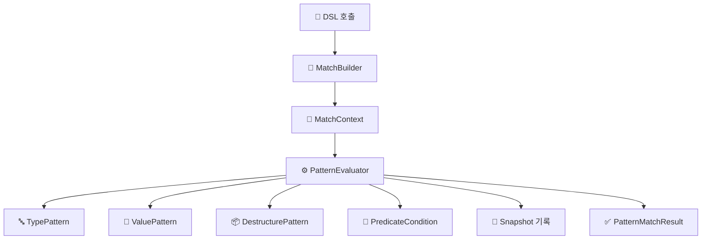

# 🔍 Kt-pattern - Kotlin Pattern Matching DSL

Kotlin에서 구조적 분기와 타입 기반 조건을 더 선언적이고 직관적으로 다룰 수 있는 패턴 매칭 DSL입니다.

표현력이 제한적인 when 문을 보완하고자 했으며, 현재 Kotlin 생태계에 마땅한 대안이 없어 직접 구현하게 되었습니다.

---

## ✨ Motivation

Kotlin은 기본적으로 when 문을 통해 정적 타입 기반 분기는 지원하지만, 다음과 같은 한계가 있습니다:

런타임 타입 기반 분기를 깔끔하게 처리하기 어렵고,

값 기반 매칭이나 복합 조건(type + predicate)을 표현하기 위해선 is, ==, &&, if 등을 얽어 써야 하며,

sealed class를 사용해도 중첩 분기와 복잡한 조건문으로 인해 가독성이 떨어지기 쉽습니다.

즉, Kotlin의 when 문은 표현력이 부족한 경우가 많습니다.
예를 들어:

- 타입과 값, 구조를 동시에 매칭하고 싶을 때

- 복잡한 조건문을 선언적으로 분기하고 싶을 때

- 가독성과 유지보수가 중요한 DSL 구조가 필요할 때

---

## 🛠 기술 스택

- Kotlin 1.9.x
- Gradle Kotlin DSL
- JUnit5 (테스트)

---

## Installation

To use `Kt-pattern` in your project, add the following dependency to your `build.gradle`:

```gradle
dependencies {
    implementation "com.ktpattern:kt-pattern:1.0.0"
}
```

---

## 🚀 Features
| 기능 | 예제 |
|------|------|
| **타입 기반 매칭 (Type Matching)** | `whenType<String> { "It's a String: $it" }` |
| **값 기반 매칭 (Value Matching)** | `whenValue(123) { "Matched value: $it" }` |
| **구조 분해 매칭 (Destructuring Matching)** | `caseOf<Person> { "Person: ${it.name}" }` |
| **조건부 매칭 (Predicate DSL)** | `caseOf<Box<Int>>({ it.value > 10 }) { "Boxed: ${it.value}" }` |
| **스마트 캐스트 연계 (Smart Cast)** | `caseOf<Dog>({ it.age < 10 }) { "Young dog: ${it.name}" }` |
| **Sealed class 지원** | `whenType<Animal> { "Animal: $it" }` |
| **커스텀 패턴 정의 (Custom Pattern)** | `case(customPattern) { "Matched custom" }` |
| **매칭된 값 DSL action에 전달** | `caseOf<Person> { person -> "Hi ${person.name}" }` |
| **매칭 과정 스냅샷 기록 (Snapshot Logging)** | `match(input, snapshotBinder = binder) { ... }` |

> 📌 Snapshot 기능은 매칭 실행 중 입력값, 패턴, 매칭 상태(Matched/NotMatched 등)를 기록하며  
> `SnapshotBinder.getAll()`을 통해 전체 평가 로그를 확인할 수 있습니다.

---

## 🧠 모듈 설계 목표 및 구성

본 프로젝트는 선언형 패턴 매칭 DSL의 **표현력, 재사용성, 확장성**을 높이기 위해  
다음과 같은 설계 원칙을 기반으로 멀티모듈 아키텍처를 구성합니다.

### 1. 구조 분리 (기능 책임별 모듈화)

- 핵심 추상화(core), evaluator 및 실행 로직(runtime), DSL 호출부(dsl) 등을 모듈로 분리하여  
  각 책임을 명확히 합니다.
- 의존성 방향은 단방향으로 구성되어 있으며, 하위 모듈에 대한 직접 접근 없이 동작합니다.

> 예: `dsl-dsl` → `dsl-runtime` → `dsl-core`

### 2. 실행 분리 (main() 기반 실행 예제)

- 별도의 실행 환경 모듈은 존재하지 않지만, `examples` 모듈을 통해 DSL의 사용 흐름을 실제 코드로 검증할 수 있습니다.
- 이는 도메인 로직과 실행 흐름을 분리하여 구조적 유연성을 높이는 기반이 됩니다.

### 3. 내부 캡슐화 및 교체 가능한 구조

- 각 모듈은 동일한 패키지 네이밍을 따르되, `internal` 키워드를 적극적으로 활용하여 불필요한 노출을 방지합니다.
- evaluator 등은 `ServiceLoader`를 통해 런타임 시점에서 교체 가능하며, 외부 환경에 따라 구현체만 바꿔도 전체 DSL은 그대로 사용할 수 있는 구조입니다.

📌 필요 시 web, batch, cli 등 다양한 실행 환경으로 DSL을 확장 가능하도록 설계되어 있습니다.  
현재는 라이브러리 자체의 본질에 충실하게 의존성을 최소화하려 하며, 내부 기능의 완성도를 높이는 데에 초점을 두고 있습니다.

---

## 🧩 멀티모듈 구성

| 모듈명        | 설명                                                           |
| ------------- |--------------------------------------------------------------|
| `dsl-core`    | 핵심 구조 및 패턴 정의 (`Pattern`, `MatchResult`, `PatternEvaluator`) |
| `dsl-runtime` | 평가 로직 구현 (`DefaultPatternEvaluator`, `Snapshot`)             |
| `dsl-dsl`     | 사용자 DSL 호출부 (`match`, `case`, `MatchBuilder`)                |
| `dsl-test`    | 테스트 유틸 및 도구                                                  |
| `examples`    | DSL 사용 예시를 담은 실행 가능 데모 코드 (`main()`, 샘플 매칭 로직)               |

---

## 🧱 Architecture Overview

사용자 DSL 호출  
▼  
**MatchBuilder** (사용자 정의 패턴 + 액션 수집)  
▼  
**MatchContext** (패턴 목록 + 입력값 바인딩)  
▼  
**PatternEvaluator** (재귀적 평가 로직)  
├── TypePattern  
├── ValuePattern  
├── DestructurePattern  
├── PredicateCondition  
└── (선택적) Snapshot 기록

▼  
**PatternMatchResult** (Success / Failure / Bindings)

---


## 📝 License


This project is licensed under the [MIT License](./LICENSE) © 2025 Acacian