```mermaid
graph TD
    User["👤 DSL 호출"]
    MB["🧱 MatchBuilder"]
    CTX["🌿 MatchContext"]
    EVAL["⚙️ PatternEvaluator"]
    TP["🔤 TypePattern"]
    VP["🔢 ValuePattern"]
    DP["📦 DestructurePattern"]
    PC["📃 PredicateCondition"]
    MR["✅ PatternMatchResult"]

    User --> MB --> CTX --> EVAL
    EVAL --> TP
    EVAL --> VP
    EVAL --> DP
    EVAL --> PC
    EVAL --> MR
```

# 🔍 Kt-pattern - Kotlin Pattern Matching DSL

Kotlin에서 구조적 분기와 타입 기반 조건을 더 선언적이고 직관적으로 다룰 수 있는 패턴 매칭 DSL입니다.

표현력이 제한적인 when 문을 보완하고자 했으며, 현재 Kotlin 생태계에 마땅한 대안이 없어 직접 구현하게 되었습니다.

---

## ✨ Motivation

📌 왜 이 DSL이 필요한가?

Kotlin은 기본적으로 when 문을 통해 정적 타입 기반 분기는 지원하지만, 다음과 같은 한계가 있습니다:

런타임 타입 기반 분기를 깔끔하게 처리하기 어렵고,

값 기반 매칭이나 **복합 조건(type + predicate)**을 표현하기 위해선 is, ==, &&, if 등을 얽어 써야 하며,

sealed class를 사용해도 중첩 분기와 복잡한 조건문으로 인해 가독성이 떨어지기 쉽습니다.

즉, Kotlin의 when 문은 표현력이 부족한 경우가 많습니다.
예를 들어:

- 타입과 값, 구조를 동시에 매칭하고 싶을 때

- 복잡한 조건문을 선언적으로 분기하고 싶을 때

- 가독성과 유지보수가 중요한 DSL 구조가 필요할 때

---

## 🛠 기술 스택

- Kotlin 1.9.x
- Gradle Kotlin DSL
- JUnit5 (테스트)

---

## Installation

To use `Kt-pattern` in your project, add the following dependency to your `build.gradle`:

```gradle
dependencies {
    implementation "com.ktpattern:kt-pattern:1.0.0"
}
```

---

## 🚀 Features

| 기능 | 예제 |
|------|------|
| **타입 기반 매칭 (Type Matching)** | `whenType<String> { "It's a String: $it" }` |
| **값 기반 매칭 (Value Matching)** | `whenValue(123) { "Matched value: $it" }` |
| **구조 분해 매칭 (Destructuring Matching)** | `caseOf<Person> { "Person: ${it.name}" }` |
| **조건부 매칭 (Predicate DSL)** | `caseOf<Box<Int>>({ it.value > 10 }) { "Boxed: ${it.value}" }` |
| **스마트 캐스트 연계 (Smart Cast)** | `caseOf<Dog>({ it.age < 10 }) { "Young dog: ${it.name}" }` |
| **Sealed class 지원** | `whenType<Animal> { "Animal: $it" }` |
| **커스텀 패턴 정의 (Custom Pattern)** | `case(customPattern) { "Matched custom" }` |
| **매칭된 값 DSL action에 전달** | `caseOf<Person> { person -> "Hi ${person.name}" }` |

---

## 🧠 모듈 설계 목표 및 구성

본 프로젝트는 선언형 패턴 매칭 DSL의 확장성과 재사용성을 높이기 위해  
아래와 같은 3단계 설계 원칙을 기반으로 멀티모듈 아키텍처를 구성합니다.

### 1. 구조 분리 (Implementation 분리)  
- 책임 단위(core, runtime, dsl 등)로 모듈을 나누고  
  의존성 방향을 명확히 설정합니다.  
  (예: `dsl-dsl` → `dsl-runtime` → `dsl-core`)

### 2. 실행 분리 (Runtime 분리)  
- 실행 환경(web, batch 등)을 독립 모듈로 구성하여  
  실행 단위를 분리합니다. 각 모듈은 자체 `main()` 진입점을 가질 수 있습니다.

### 3. import 최소화 및 내부 캡슐화  
- 동일한 패키지 구조를 유지하고, `internal` 등을 활용해  
  모듈 간 불필요한 노출을 최소화합니다.  
  이를 통해 런타임 시점에서 구현체만 교체하는 구조를 지향합니다.

---

## 🧩 멀티모듈 구성

| 모듈명        | 설명                                                                 |
| ------------- | -------------------------------------------------------------------- |
| `dsl-core`    | 핵심 구조 및 패턴 정의 (`Pattern`, `MatchResult`, `PatternEvaluator`) |
| `dsl-runtime` | 평가 로직 구현 (`DefaultPatternEvaluator`, snapshot 등)              |
| `dsl-dsl`     | 사용자 DSL 호출부 (`match`, `case`, `MatchBuilder`)                  |
| `dsl-test`    | 테스트 유틸 및 도구                                                  |
| `examples`    | DSL 사용 예시를 담은 실행 가능 데모 코드 (`main()`, 샘플 매칭 로직)   |

---

## 🧱 Architecture Overview

사용자 DSL 호출  
▼  
**MatchBuilder** (사용자 정의 패턴 + 액션 수집)  
▼  
**MatchContext** (패턴 목록 + 입력값 바인딩)  
▼  
**PatternEvaluator** (재귀적 평가 로직)  
├── TypePattern  
├── ValuePattern  
├── DestructurePattern  
└── PredicateCondition  
▼  
**PatternMatchResult** (Success / Failure / Bindings)

---


